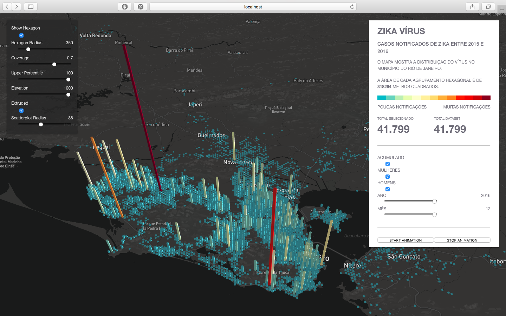
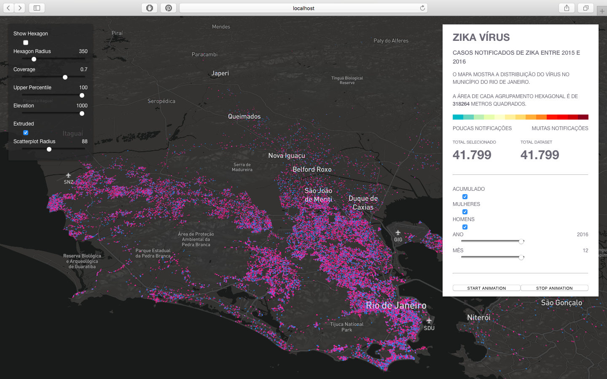

# Casos de Zika no Município do Rio de Janeiro

Projeto para a disciplina de **Visualização da Informação** do mestrado em Modelagem Matemática da FGV/EMAp 2017.

## Projeto

Fazer um mapa interativo dos casos notificados de Zika no município do Rio de Janeiro entre 2015 e 2016. Uma exibição gráfica que mapeia a geo-localização dos casos notificados do vírus. Uma visualização interativa com escala de tempo a partir das datas de notificações dos casos do ZIKV.

A ferramenta de visualização escolhida é o [DeckGl](http://deck.gl) desenvolvido pelo Uber. A ideia é usar uma camada hexagonal ([HexagonLayer](http://uber.github.io/deck.gl/#/examples/core-layers/hexagon-layer)) para representar os dados no mapa. Essa abordagem é uma boa forma de lidar com casos em que há um grande número de pontos de dados.

### Motivação

* Em Março de 2015, a circulação do vírus Zika (ZIKV) foi detectada pela primeira vez no Brasil (Bahia). Alastrou-se rapidamente pelo país e, em menos de um ano, ele já circulava em todos as unidades da federação.

* Em Fevereiro de 2016, a OMS declarou uma emergência de saúde pública de importância internacional.

* Segundo o Boletim Epidemiológico emitido pelo Ministério da Saúde, até Setembro de 2016, o Rio de Janeiro é o segundo estado com maior incidência de infeção pelo vírus. Se considerarmos em termos absolutos, o estado fica em primeiro lugar.

* Desde os primeiros casos relatados, estima-se que entre 440.000 e 1.300.000 infecções ocasionadas pelo ZIKV ocorreram no Brasil, resultando na maior epidemia do ZIKV registrada até o momento.

* Transmissão do Vírus:
	1. Transmissão vetorial;
	2. Transmissão sexual e período latente;
	3. Assintomática;
	4. Transmissão vertical;
	5. Apesar de não ser muito comum, outras formas de transmissão entre humanos foram confirmadas recentemente a partir da identificação do vírus na urina e saliva.

### Objetivos

* Como ocorreu o espalhamento dos casos notificados do vírus Zika no município do Rio de Janeiro entre 2015 e 2016?

* Como estão distribuídos os casos de Zika no Rio de Janeiro?

* Quais as regiões que possuem maiores incidências? 

## Recursos

As linguagens utilizadas foram JavaScript, HTML e CSS.

* [Node.js](https://nodejs.org/en/);
* [Deck.gl](https://github.com/uber/deck.gl);
* [Luma.gl](https://uber.github.io/luma.gl/#/);
* [React-map-gl](https://uber.github.io/react-map-gl/#/);
* [React](https://reactjs.org/docs/react-component.html);
* [React-vis](http://uber.github.io/react-vis/);
* [Mapbox](https://www.mapbox.com);

## Visualização

Copie o conteúdo desta pasta pata seu projeto e execute os seguintes comandos no terminal.

```
npm install
npm start
```

Executando `npm start` na pasta do projeto e abrindo [http://localhost:3000](http://localhost:3000) no browser, teremos a seguinte visualização usando a `HexagonLayer`:



Também tem a opção de visualização usando a `ScatterplotLayer`, onde podemos perceber a predominância de casos notificados em mulheres (pontos em rosa):



### Dados

* Os dados da Zika correspondem a todos os casos notificados entre 2015 e 2016 no município do Rio de Janeiro. Os dados são provenientes do Sinan, que é o Sistema de Informação de Agravos de Notificação.

* As datas das notificações estão entre 05/01/2015 a 13/10/2016.

* Possui 41.860 entradas e 76 atributos.


### Layers: Hexagon e Scatterplot

A camada hexagonal ([HexagonLayer](https://uber.github.io/deck.gl/#/documentation/layer-catalog/hexagon-layer)) desenha células hexagonais de área igual e renderiza um heatmap  baseado em agregações de pontos. A diferença está que nessa camada primeiro agregam-se os pontos de dados fornecidos pelo usuário nas células e, em seguida, desenha as células usando os valores agregados para controlar propriedades como a cor e a altura. Por default, a cor e a altura de cada hexágono são dimensionadas pelo número de pontos que contém.

Algumas das propriedades da HexagonLayer podem ser controladas na visualização (painel esquerdo).

Scatterplots são uma maneira direta de visualizar a distribuição de dados em um plano XY, especialmente quando procuramos tendências ou clusters. Mas quando você tem um conjunto de dados com um grande número de pontos, muitos desses pontos de dados podem se sobrepor. Este efeito de superação pode tornar difícil ver tendências ou clusters.

Existem muitas razões para o uso de hexágonos para obter uma superfície 2D como um plano, a mais evidente é que os hexágonos são mais parecidos com o círculo do que o quadrado, por exemplo. Isso se traduz em agregação de dados mais eficiente em torno do centro do compartimento.

## Atualizações Pendentes (Trabalhos Futuros)

* Mudar a forma como é agregada as cores. Uma distribuição considerando o desvio padrão. A paleta está um pouco estourada para poucos casos. 

* Substituir as informações de latitude e longitude por região/bairro.

* Dividir o número total de casos em cada hexágono pela quantidade populacional, ou seja, queremos a quantidade de casos per capita.

## Referências

* [Visualization Tutorial](https://abmai.github.io/vis-tutorial) e seu repositório no GitHub [abmai/vis-tutorial](https://github.com/abmai/vis-tutorial).


